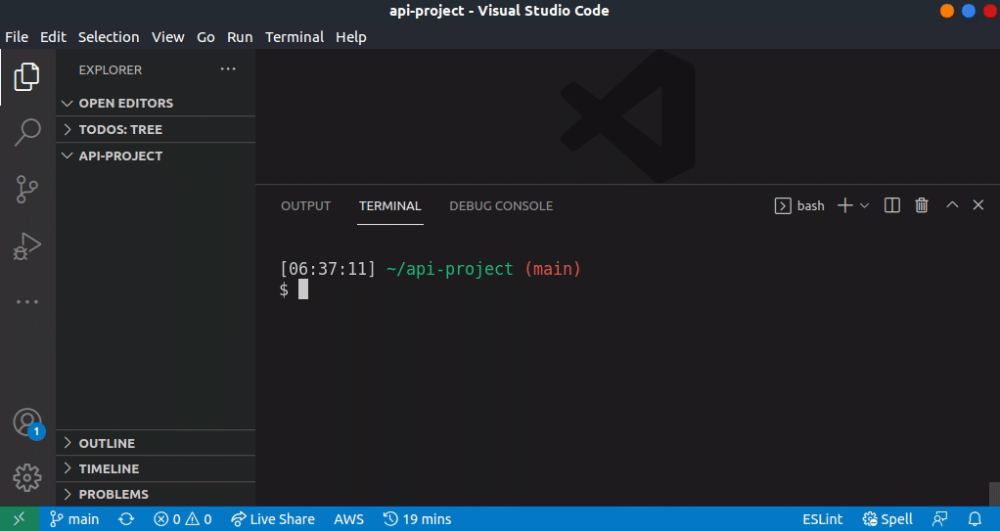

# Compeller



🚨 Alpha software 🚨

A strong typescript binding for your OpenAPI Schema that doesn't need generation.

- [Compeller](#compeller)
  - [About](#about)
  - [Get started](#get-started)
  - [🛣️ Roadmap](#️-roadmap)
    - [Usage](#usage)
  - [Shoulders](#shoulders)

## About

Compeller tries to infer your OpenAPI validations and responses, from a typed OpenAPI specification.

## Get started

You can use the CLI to start a new project, generating an OpenAPI specification.

```bash
npx compeller new
```

## 🛣️ Roadmap

- [x] Support for request body validation to type guard (ajv)
- [ ] Support for response type mapping
- [ ] Support for path validation
- [ ] Support header validation
- [ ] Support for header response types

### Usage

Create a Schema specification for an API Model like:

```ts
// ./examples/standalone/openapi/schemas/version.schema.ts

import { FromSchema } from 'json-schema-to-ts';

export const VersionSchema = {
  type: 'object',
  required: ['version'],
  additionalProperties: false,
  properties: {
    version: {
      type: 'string',
    },
  },
} as const;

export type Version = FromSchema<typeof VersionSchema>;

```

Next, bind the model into an OpenAPI specification object.

```ts
// ./examples/standalone/openapi/spec.ts

import { VersionSchema } from './schemas/version.schema';

export const OpenAPISpecification = {
  info: {
    title: 'New API generated with compeller',
    version: '1.0.0',
  },
  openapi: '3.1.0',
  paths: {
    'v1/version': {
      get: {
        responses: {
          '200': {
            description: 'Get the current API version',
            content: {
              'application/json': {
                schema: VersionSchema,
              },
            },
          },
        },
      },
    },
  },
};

```

With compeller you can compile this into a typed request and response handler like:

```ts
import { OpenAPISpecification } from './spec';

// The api is inferred, and validations are generated
const api = compeller(OpenAPISpecification);

// These routes and methods are enforced
const { response } = api('/v1/version', 'get');

// The response code and body schema are bound
const resp = response('200', { name: 'Type-safe reply' });
```

See [./examples](./examples)

## Shoulders

Compell is built on top of some great libraries, at it's core it relies on:

- [openapi3-ts](https://github.com/metadevpro/openapi3-ts)
- [json-schema-to-ts](https://github.com/ThomasAribart/json-schema-to-ts)

It also layers on request and response validation powered by:

- [ajv](https://github.com/ajv-validator/ajv)

I'm grateful for these libraries
